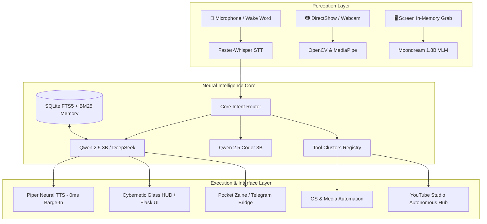

# ⚡ Z.A.I.N.E (Zero-latency Autonomous Intelligent Neural Entity)

<p align="center">
  
  
  
  
  
  
</p>

<p align="center">
  <b>A 100% offline, privacy-first embodied AI desktop assistant & digital sentinel.</b><br>
  Engineered with zero mandatory cloud dependencies, local neural model orchestration, real-time voice barge-in, spatial vision, and bidirectional mobile execution.
</p>

---

## 🌟 Overview

**Z.A.I.N.E** (*Zero-latency Autonomous Intelligent Neural Entity*) is a fully local, privacy-first AI desktop assistant. Running locally via **Ollama**, **Faster-Whisper**, **Piper-TTS**, and **DirectShow**, Zaine bridges conversational intelligence, desktop system telemetry, air-gesture computer interaction, and remote mobile execution via Telegram without streaming your data to third-party cloud servers.

---

## 🏛️ System Architecture



---

## 🧠 Neural Models & Subsystems

| Subsystem | Model / Technology | Execution Tier | Purpose |
| :--- | :--- | :--- | :--- |
| **Primary Brain** | `zaine:latest` (Fine-tuned Qwen 2.5 3B) | GPU VRAM | Conversational reasoning, persona, tool orchestration |
| **Code Engine** | `zaine-coder:latest` (Qwen 2.5 Coder 3B) | GPU VRAM | Local code synthesis, terminal troubleshooting, debugging |
| **Vision Perception** | `moondream:latest` (1.8B VLM) | GPU VRAM | Screen diagnostics, webcam inspection, desk presence |
| **Speech-to-Text** | `Faster-Whisper` (base.en / tiny) | CPU / CUDA | Low-latency streaming wake word detection & transcription |
| **Neural TTS** | `Piper-TTS` (`en_GB-alan-medium`) | Local CPU | Natural conversational speech with **0.00ms barge-in** |
| **Air Gestures** | MediaPipe Hands + OpenCV | Local CPU | Real-time skeletal gesture tracking & workspace hotkeys |
| **Second Brain** | SQLite FTS5 + BM25 | Local Disk | Millisecond local full-text search across knowledge vaults |

---

## 🚀 Key Features

### 🎙️ 1. Voice Interaction with Real-Time Barge-In
- **Continuous Wake Word:** Say *"Zaine"* to awaken. Features an automatic 10-second follow-up window.
- **Instant 0ms Barge-In:** Speak *"Stop"*, *"Wait"*, or hit any key to instantly interrupt synthetic speech playback with zero lag.
- **Multilingual Support:** Crisp English by default, seamlessly adapting to conversational Hindi/Urdu when prompted.

### 👁️ 2. Spatial Vision & Gesture Controls
- **Screen Perception (`see_screen`):** In-memory display buffer captures to diagnose errors, inspect layout designs, or analyze code.
- **Micro-burst Webcam Inspection (`see_camera`):** Sub-500ms hardware grab for object and desk analysis with immediate sensor release.
- **IronHands Air Gesture System:** Control windows, switch apps, or trigger system macros with real-time hand gestures.
- **Desk Presence Sentinel:** Proactively recognizes when you return to your workspace.

### 📱 3. Pocket Zaine (Remote Mobile Bridge)
- **Telegram Bot Integration:** Secure bidirectional tunnel with user pairing and PIN verification.
- **Command Palette:** Access `/status`, `/screen`, `/camera`, `/vault`, `/tasks`, and `/remind` right from your phone.
- **Mobile Vision Dispatch:** Send images from your smartphone for immediate on-premise local visual analysis.

### 🎬 4. Autonomous Content Studio & Tools
- **YouTube Studio Engine:** Automated script drafting, asset generation, timeline orchestration, and scheduled publishing.
- **System Automation:** App launcher, process watchdog, media controller, and battery power sentinel.

---

## 🛠️ Quick Start

### 1. Prerequisites
- **Python 3.10+**
- [Ollama](https://ollama.com) installed and running.

Pull the local models:
```bash
ollama pull qwen2.5:3b
ollama pull qwen2.5-coder:3b
ollama pull moondream
```

### 2. Installation
Clone the repository and install required packages:
```bash
git clone https://github.com/hmohammedmateenullashariff-bit/Z.A.I.N.E.git
cd Z.A.I.N.E
pip install -r requirements.txt
```

### 3. Environment Setup
Copy the configuration template:
```bash
cp .env.example .env
```
Populate `.env` with your preferred settings:
```env
TELEGRAM_BOT_TOKEN="your_bot_token"
TELEGRAM_AUTHORIZED_USER_ID="your_telegram_id"
TELEGRAM_PAIR_PIN="your_secure_pin"
GMAIL_ADDRESS="your_assistant_email@gmail.com"
GMAIL_APP_PASSWORD="your_app_password"
USER_PERSONAL_EMAIL="your_email@gmail.com"
```

### 4. Running Zaine

* **Launch Full Assistant & Cybernetic HUD:**
  ```bash
  python main.py
  ```

* **Launch Headless Remote Bridge (Background Daemon):**
  ```bash
  python telegram_bridge.py
  ```

---

## 📂 Project Structure

```text
├── agent.py               # Core conversational agent logic & tool router
├── approval.py            # Safety & permission gating for OS actions
├── camera_stream.py       # Camera feed mutex & hardware controller
├── coordinator.py         # Subsystem task scheduler & lifecycle manager
├── core_router.py         # Semantic intent classification
├── face_id.py             # Local face recognition & verification
├── gesture_control.py     # MediaPipe air gesture detection
├── heartbeat.py           # Background health check & system sentinel
├── main.py                # Primary system entrypoint
├── memory.py              # Context window manager & SQLite persistence
├── tools.py               # Desktop system automation tools
├── vision.py              # Multimodal screen & camera perception
├── voice.py               # Whisper STT & Piper TTS engine
├── electron/              # Desktop client container
├── static/                # HUD styles, assets, and frontend scripts
├── templates/             # Glassmorphism cybernetic HUD templates
└── youtube_studio/        # Autonomous content generation & scheduling
```

---

## 🛡️ Privacy & Security

Z.A.I.N.E is designed with privacy as a foundational principle:
- **No Cloud LLM Telemetry:** All inference runs on your own hardware via Ollama.
- **Hardware Isolation:** Camera and audio inputs are released immediately after capture.
- **Sandboxed Action Approvals:** High-impact system commands require explicit confirmation.

---

## 📜 License

Distributed under the [MIT License](LICENSE). See `LICENSE` for more information.
