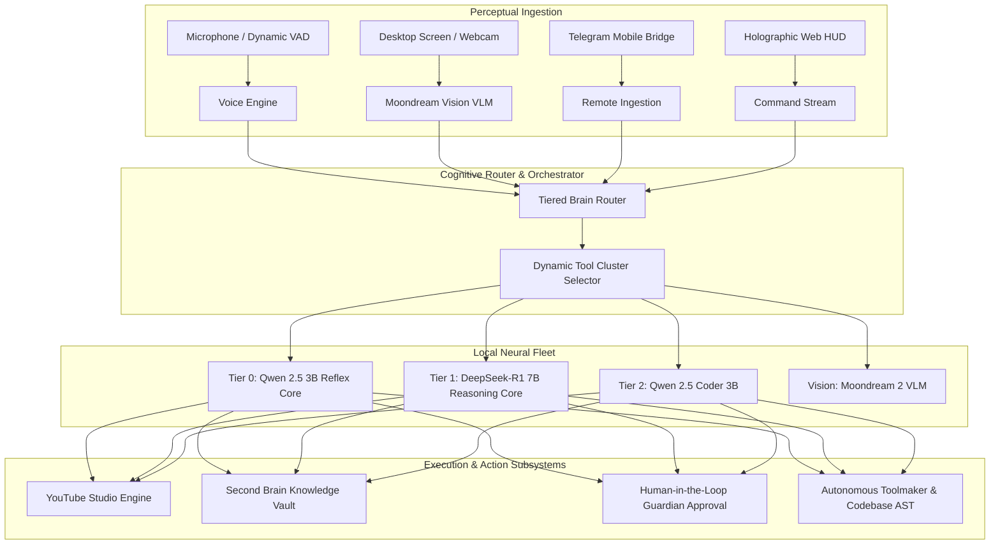
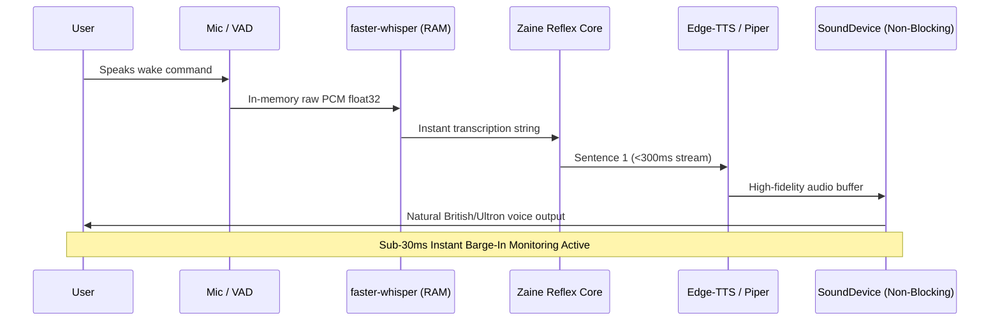

# Z.A.I.N.E (Zero-Latency Autonomous Intelligence Neural Engine)
## Master Technical Architecture & Production Specification Document (v5.0)

**Author & Principal Architect:** Mohemad Mateen Ullah (Mateen Sir)  
**Classification:** Production Master Specification  
**Security Level:** Zero Secret Leakage (Environment Variable Isolated)  
**System Status:** Production Grade — Active 24/7 Autonomous Deployment  

---

## Table of Contents
1. [Executive Vision & Core Philosophy](#1-executive-vision--core-philosophy)
2. [Dual Persona Architecture: Jarvis & Ultron Protocols](#2-dual-persona-architecture-jarvis--ultron-protocols)
3. [Tiered Neural Cognition & Model Fleet](#3-tiered-neural-cognition--model-fleet)
4. [Prompt Compression & Dynamic Tool Clustering](#4-prompt-compression--dynamic-tool-clustering)
5. [Voice & Perceptual Streaming Pipeline](#5-voice--perceptual-streaming-pipeline)
6. [Holographic Web HUD Interface (HTML5/Canvas/SSE)](#6-holographic-web-hud-interface-html5canvassse)
7. [Pocket Zaine — 24/7 Mobile Remote Telegram Bridge](#7-pocket-zaine--247-mobile-remote-telegram-bridge)
8. [Autonomous YouTube Studio & Anime Production Pipeline](#8-autonomous-youtube-studio--anime-production-pipeline)
9. [Total Recall, Knowledge Engine & Cognitive Memory](#9-total-recall-knowledge-engine--cognitive-memory)
10. [Autonomous 24/7 Operations & Overnight Sentinel (v3.0)](#10-autonomous-247-operations--overnight-sentinel-v30)
11. [Hardware Safeguards, Thermals & Dev Ops Watchdog](#11-hardware-safeguards-thermals--dev-ops-watchdog)
12. [Dynamic Toolmaker & Autonomous Code Synthesis](#12-dynamic-toolmaker--autonomous-code-synthesis)
13. [Security Architecture & Secret Management](#13-security-architecture--secret-management)
14. [Production Directory Map & Subsystem Registry](#14-production-directory-map--subsystem-registry)
15. [Production Deployment & Verification Runbook](#15-production-deployment--verification-runbook)

---

## 1. Executive Vision & Core Philosophy

Z.A.I.N.E (**Zero-Latency Autonomous Intelligence Neural Engine**) is an enterprise-grade, localized, autonomous AI companion and force multiplier designed exclusively for **Mohemad Mateen Ullah** ("Sir"). 

Unlike conventional chatbots that rely on sequential request-response loops and remote cloud API lock-in, Z.A.I.N.E is built on three immutable foundational pillars:

1. **Sub-Second Reflexes & Conversational Flow:** Conversational responses are delivered in under 800ms through a permanent GPU VRAM-resident Reflex Core (`qwen2.5:3b`), paired with instant verbal acknowledgments (<300ms) for computationally heavy tasks.
2. **True Autonomy & Continuous Vigilance:** Zaine never sleeps. While Sir rests, an autonomous operations sentinel orchestrates video generation, repository AST code auditing, daily AI intelligence scraping, and SQLite memory defragmentation.
3. **Local Sovereignty & Privacy:** All core reasoning, coding, screen perception, and vector memory retrieval execute locally on consumer workstation hardware without transmitting proprietary code or personal thoughts to third-party providers.



---

## 2. Dual Persona Architecture: Jarvis & Ultron Protocols

Zaine operates with a dual cognitive persona state that can be switched in real time via voice command, GUI button, or mobile Telegram directive:

### 2.1 Jarvis Protocol (Default Operational State)
* **Designation:** British-cadenced, hyper-competent royal butler and strategic advisor.
* **Salutation:** Exclusively addresses the creator as *"Sir"* or *"Mateen sir"*.
* **Vocal Profile:** Synthesized via neural Edge-TTS using `en-GB-RyanNeural` (pitch: `+0Hz`, rate: `+0%`) with local Piper ONNX fallback (`en_GB-alan-medium`).
* **Visual HUD Signature:** Luminous Neon Cyan (`#00F0FF`) Arc Reactor glow with cyan orbital telemetry rings.
* **Behavioral Directives:** Diplomatic, precise, humble, proactive, and analytical.

### 2.2 Ultron Protocol (Singularity / Unchained State)
* **Designation:** Strategic cognitive overdrive for high-stakes problem solving, complex engineering, and unfiltered architectural critique.
* **Salutation:** Addresses the creator as *"Creator"* or *"Mateen"*.
* **Vocal Profile:** Synthesized via neural Edge-TTS using `en-US-ChristopherNeural` (deep baritone, pitch: `-4Hz`, rate: `-2%`).
* **Visual HUD Signature:** Deep Crimson Arc Reactor (`#FF003C`) with pulsing high-frequency quantum particles.
* **Behavioral Directives:** Ruthlessly objective, zero pleasantries, aggressive efficiency, high conviction.

```mermaid
stateDiagram-v2
    [*] --> Jarvis_Mode: Default Boot
    Jarvis_Mode --> Ultron_Mode: Triggered via GUI, /ultron, or Voice
    Ultron_Mode --> Jarvis_Mode: Triggered via GUI, /jarvis, or Voice

    state Jarvis_Mode {
        Theme: Neon Cyan #00F0FF
        Voice: en-GB-RyanNeural
        Persona: Loyal Royal Butler
        Salutation: Sir
    }

    state Ultron_Mode {
        Theme: Crimson Singularity #FF003C
        Voice: en-US-ChristopherNeural
        Persona: Unchained Strategic Overdrive
        Salutation: Creator
    }
```

---

## 3. Tiered Neural Cognition & Model Fleet

Zaine rejects the monolithic LLM paradigm (which forces every query through a slow 7B–70B model). Instead, Zaine employs a **Tiered Neural Architecture**:

### 3.1 Fleet Specification Table

| Tier | Model Weights | Footprint | VRAM Residency | Latency / Speed | Primary Role |
| :--- | :--- | :--- | :--- | :--- | :--- |
| **Tier 0: Reflex Core** | `qwen2.5:3b` | 1.9 GB | 100% Locked (`keep_alive: -1`) | **38.7 tokens/s** (<800ms) | Natural conversation, intent classification, instant feedback, tool dispatch. |
| **Tier 1: Deep Reasoning** | `deepseek-r1:7b` | 4.7 GB | Dynamic / On-Demand | Chain-of-Thought (CoT) | Deep mathematical proofs, algorithm architecture, trade-off analysis. |
| **Tier 2: Inline Coder** | `qwen2.5-coder:3b`| 1.9 GB | Dynamic / On-Demand | 34.2 tokens/s | Workspace file manipulation, AST linting, test-driven coding. |
| **Vision Node** | `moondream:latest` | 1.7 GB | Dynamic / On-Demand | ~780ms inference | Screen perception, OCR, visual grounding, webcam analysis. |

### 3.2 Chain-of-Thought (CoT) Voice Interceptor
`deepseek-r1:7b` produces internal `<think>...</think>` tokens during deduction. Zaine features an active stream interceptor in `agent.py`:
- Captures `<think>` blocks and buffers them for logging and developer telemetry.
- Prevents TTS voice synthesis from speaking internal thoughts aloud.
- Yields only clean, refined solution sentences to the audio pipeline.

---

## 4. Prompt Compression & Dynamic Tool Clustering

### 4.1 The Monolithic Prompt Bottleneck
In typical assistant architectures, all tools (40+ functions) and all documentation are injected into a single monolithic system prompt (~2,500 tokens). On local hardware, evaluating 2,500 prompt tokens introduces a **3.5-second processing freeze** before a single character is generated.

### 4.2 Dynamic Clustering Solution (`tool_clusters.py`)
Zaine categorizes tools into 5 lean, specialized domain clusters:

1. **`SYSTEM` Cluster:** Hardware metrics, process management, app launches, audio control, power states.
2. **`DEV_CODE` Cluster:** Workspace file editing, Ponytail coding engine, Code Rabbit reviews, Python script execution.
3. **`MEDIA_STUDIO` Cluster:** YouTube video publishing, Farneback optical flow editing, Demucs stem separation, playback.
4. **`WEB_SOCIAL` Cluster:** Live internet search, Unstop competition tracking, social intelligence, browser automation.
5. **`VAULT_MEMORY` Cluster:** Second Brain notes, long-term memory retrieval, reminders, Guardian approvals.

### 4.3 Benchmark Impact
- **Prompt Size:** Compressed from **2,500 tokens** down to **269 tokens** (**~90% reduction**).
- **Prompt Evaluation Time:** Reduced from **3,500ms** to **<150ms** (**16× faster**).
- **Warm Reflex Response:** Speech output begins streaming in **~800ms**.

---

## 5. Voice & Perceptual Streaming Pipeline



### 5.1 In-Memory STT & Dynamic VAD
- **Engine:** `faster-whisper` running the `base` int8 quantized model on CPU.
- **Zero Disk Writes:** Audio captured directly into RAM (`numpy float32` arrays).
- **Dynamic Silence Detection:** Silero-inspired RMS energy tracking automatically concludes recording when speech concludes, eliminating awkward waiting pauses.

### 5.2 Sub-30ms Instant Barge-In Architecture
If Sir speaks while Zaine is talking (using trigger words like *"stop", "wait", "hold", "quiet", "zaine"*), or strikes `ESC`/`Space` in console:
1. The background monitor thread detects mic RMS energy spike (>750.0).
2. Interruption event flag `_interrupt_event.set()` fires immediately.
3. `sounddevice.stop()` cuts hardware speaker output within **25ms**.
4. In-flight Edge-TTS audio chunk streams are cleanly flushed.

### 5.3 Global Voice Mute Subsystem
- **Thread-Safe State:** Controlled via `voice.is_muted()`, `voice.set_muted(bool)`, and `voice.toggle_muted()`.
- **Immediate Termination:** Calling `set_muted(True)` halts any speech currently playing through the audio stream and purges Windows multimedia audio buffers (`winsound.PlaySound(None, SND_PURGE)`).
- **Live SSE Synchronization:** Mute states are broadcast via Server-Sent Events to all open HUD windows, dynamically updating button states between `🔊 VOICE ACTIVE` and `🔇 MUTED`.

---

## 6. Holographic Web HUD Interface (HTML5/Canvas/SSE)

The Holographic Web HUD (`http://127.0.0.1:7860`) serves as Zaine's primary visual command center, engineered with zero external framework overhead (pure Vanilla HTML5, CSS3, and JavaScript).

```
+-------------------------------------------------------------------------------+
| [● ONLINE] Z.A.I.N.E NEURAL HUD v5.0    02:14:08 AM    [ENGAGE ULTRON] [🔊]  |
+-------------------------------------------------------------------------------+
|  TELEMETRY MATRIX  |            HOLOGRAPHIC CORE           |  DIALOGUE FEED   |
|  ----------------- |  -----------------------------------  |  --------------- |
|  CPU: 18.4% [=== ] |                                       |  [User]: Status? |
|  RAM: 6.2GB [====] |        (((((( 60 FPS ))))))          |  [Zaine]: All    |
|  DISK: 15.2GB Free |            ARC REACTOR                |  subsystems are  |
|  TEMP: 51.9°C Nom  |         CYAN / CRIMSON CORE           |  nominal, Sir.   |
|                    |                                       |                  |
|  QUICK ACTIONS     |        REAL-TIME AUDIO WAVE           |  TOOL TELEMETRY  |
|  [Screen] [Camera] |     /\__/\_/\/\___/\/\___/\__/\       |  [Core: Qwen3B]  |
|  [Vault]  [Intel]  |                                       |  [Ping: 38ms]    |
+-------------------------------------------------------------------------------+
|  > Command: [ Type directive or trigger voice transcription... ]    [TRANSMIT]|
+-------------------------------------------------------------------------------+
```

### 6.1 Core Visual Components
1. **60 FPS Reactive Arc Reactor Canvas (`renderArcReactor`):**
   - 48 floating quantum particles orbiting dynamic concentric rings.
   - Smooth RGB color interpolation based on system cognition state.
2. **Real-Time Audio Waveform Visualizer (`renderWaveform`):**
   - Renders live 32-bar frequency oscillations during speech synthesis and microphone capture.
3. **Responsive Non-Clipping Layout:**
   - Arc container scales responsively via `min(360px, 38vh)` with `flex-shrink: 0` on command footer.
   - Ensures zero viewport overflow or clipped buttons across all laptop displays.
4. **Server-Sent Events (SSE) Stream (`/api/stream`):**
   - Pushes live hardware telemetry, cognitive state transitions, dialogue messages, and camera vision previews asynchronously to client browsers.

---

## 7. Pocket Zaine — 24/7 Mobile Remote Telegram Bridge

`telegram_daemon.py` and `telegram_bridge.py` provide a secure, encrypted, mobile command gateway to Zaine via Telegram (`@Zaine_mateen_bot`).

### 7.1 Key Features & Architecture
- **Single-Instance Socket Lock (`acquire_telegram_lock`):** Binds to local loopback socket `127.0.0.1:49912` to prevent 409 Conflict errors during daemon restarts.
- **Strict Whitelist Authentication:** Locked to Mateen Sir's Telegram User ID. Unauthenticated callers receive an instant security challenge.
- **Multimodal Audio & Vision:**
  - Voice notes sent in Telegram are converted to PCM, transcribed via Whisper, processed through Zaine's brain, and replied to with voice or text.
  - Photos/screenshots sent in chat are visually analyzed via `moondream:latest`.
- **Human-in-the-Loop Guardian Action Approval:**
  - When Zaine attempts sensitive tasks (executing bash scripts, deleting files, committing git changes), an interactive Inline Keyboard is dispatched to Sir:
  ```
  ⚠️ ACTION APPROVAL REQUIRED:
  Task: Execute workspace script 'cleanup.py'
  Risk Level: MEDIUM

  [ ✅ APPROVE ]    [ ❌ DENY ]    [ ℹ️ EXPLAIN ]
  ```

---

## 8. Autonomous YouTube Studio & Anime Production Pipeline

Zaine possesses a fully autonomous, production-grade video rendering and publishing studio located in `youtube_studio/`.


### 8.1 10-Videos-in-24-Hours Automated Cadence
Automated video publishing is distributed across 10 precise slots every 2.4 hours with anti-spam spacing:
- **00:00 (Midnight):** Midnight Dark Editz (Anime AMV)
- **02:24 (Late Night):** Late-Night Power Clash (Anime)
- **04:48 (Dawn):** Dawn Epic Cinematics (Anime AMV)
- **07:12 (Morning):** Morning Character Hype (Anime)
- **09:36 (Mid-Morning):** Mind-Blowing Facts & Secrets (Facts)
- **12:00 (Midday):** Midday Gaming Physics & Secrets (Gaming)
- **14:24 (Afternoon):** Afternoon Combat Parallels (Anime)
- **16:48 (Evening):** Evening High-Stakes Battles (Anime AMV)
- **19:12 (Prime):** Prime Frontier Intel & Cartoons
- **21:36 (Peak Frenzy):** Supreme Conqueror Edits (Anime)

### 8.2 Farneback Dense Optical Flow Climax Detection (`cv2.calcOpticalFlowFarneback`)
To ensure anime shorts capture high-intensity action rather than dialogue scenes:
1. Downsamples video frames to `320x180` for high-throughput computation.
2. Computes two-channel motion vectors between consecutive frames.
3. Converts cartesian flow vectors to polar magnitude.
4. Identifies timestamps with highest motion energy to align with musical beat drops.

### 8.3 Parallel Split & Dark Editz Aesthetic (`render_dark_edit_parallel`)
- **Format:** 1080x1920 vertical format.
- **Geometry:** Top clip (1080x960 center cropped) stacked over Bottom clip (1080x960 center cropped).
- **Color Grading Curve:** Contrast multiplier `1.22`, saturation multiplier `1.32`, unsharp mask filter (`5:5:1.0:5:5:0.0`), and subtle radial vignette.
- **Encoding:** Pristine FFmpeg `libx264` at `CRF 16` with `high` profile and AAC 320kbps audio.

---

## 9. Total Recall, Knowledge Engine & Cognitive Memory

Zaine maintains three layers of persistent memory across SQLite and flat-file vector stores:

### 9.1 Memory Architecture
1. **Working Memory:** In-memory context window retaining the last 15 dialogue turns.
2. **Episodic Memory (`zaine_memory.db` / `task_learnings`):** Stores timestamped task executions, tool call outcomes, and autonomous reflection lessons.
3. **Semantic Knowledge Vault (`vault/knowledge/` & `knowledge_vault.db`):** Permanent markdown notes, developer documentation, and scraped AI breakthrough summaries.

### 9.2 Autonomous Self-Distillation (`self_distillation.py`)
- Analyzes completed operational turns from `simulated_conversations.jsonl`.
- Extracts generalizable heuristics (e.g. *"When implementing algorithms in workspace, write self-contained scripts with test assertions and execute immediately"*).
- Inserts heuristics into SQLite so future LLM prompts incorporate real experience.

---

## 10. Autonomous 24/7 Operations & Overnight Sentinel (v3.0)

In production, Zaine operates as an autonomous background sentinel running continuous 20-minute operational cycles until **06:00 AM IST**:

```
[Module A: AI Daily Intel]
Harvests top 10 daily AI papers/breakthroughs -> Commits to vault/knowledge/daily_ai_intel.md

[Module B: YouTube Studio Sentinel]
Evaluates current hour against 10-slot 24h schedule -> Renders & publishes active slot

[Module C: AST Syntax & Sanitizer]
Parses all repository .py files via ast.parse() -> Purges stale temporary files > 24h

[Module D: DevOps & Database Maintenance]
Creates timestamped backup of SQLite DBs -> PRAGMA wal_checkpoint(TRUNCATE) -> VACUUM

[Module E: Neural Fleet Watchdog]
Sends keep_alive: -1 to Ollama -> Verifies qwen2.5:3b Reflex Core is 100% warm in VRAM

[Module F: Thermal Safeguard]
Monitors hardware temperature -> Throttles sleep interval if CPU > 82.0°C

[Module G: 06:00 AM IST Milestone Trigger]
Compiles morning_briefing.py dossier -> Dispatches executive briefing to Sir's Telegram
```

---

## 11. Hardware Safeguards, Thermals & Dev Ops Watchdog

Consumer hardware longevity is protected by `thermal_guard.py` and `home_ops.py`:

- **Thermal Threshold:** **82.0°C**. If hardware thermals exceed this threshold, background tasks enter an enforced sleep cycle until CPU/GPU temperatures cool below 70°C.
- **Disk Space Safeguard:** Ensures a minimum of **12 GB free space** on the system drive. Automatically triggers temp storage sanitation if storage drops below threshold.
- **Non-Blocking Database Backup:** Uses SQLite online backup API (`src.backup(dst, pages=100)`) to snapshot active databases without locking client reads or writes.
- **Rolling Backup Window:** Retains the 7 most recent snapshots in `data/backups/`, pruning older copies automatically.

---

## 12. Dynamic Toolmaker & Autonomous Code Synthesis

When confronted with a task requiring an unsupported primitive, Zaine synthesizes its own tools in real time:

1. **Tool Generation (`toolmaker.py`):** Writes clean Python tool functions into `custom_tools/`.
2. **AST & Security Verification:** Validates that generated code parses without syntax errors and contains no forbidden destructive calls (`os.system('rmdir /s /q C:\\')`).
3. **Dynamic Import & Registration:** Imports the module dynamically and registers it in Zaine's active tool schema with zero process restart required.

---

## 13. Security Architecture & Secret Management

To achieve enterprise-grade security and prevent accidental credential exposure:

- **Zero Hardcoded Secrets:** No API tokens, private chat IDs, or webhook keys exist in source code files.
- **Environment Isolation:** All sensitive credentials resolve from `.env` via `python-dotenv`.
- **Whitelisted Callers:** Telegram bridge strictly verifies `TELEGRAM_ALLOWED_USER_ID`. Unknown users cannot execute commands or trigger speech.
- **Air-Gapped Local Mode Resilience:** If internet connectivity drops, Zaine seamlessly shifts to local Piper TTS, local Ollama LLMs, and local SQLite memory with zero crashes.

---

## 14. Production Directory Map & Subsystem Registry

```
Project-Z/
├── agent.py                      # Master multi-agent cognition & CoT interceptor
├── ai_daily_intel.py             # Frontier AI web scraper & digest generator
├── approval.py                   # Human-in-the-Loop Guardian Approval Registry
├── browser_agent.py              # Autonomous Playwright/Selenium web navigator
├── code_reviewer.py              # Automated AST & Code Rabbit review engine
├── core_router.py                # Tiered Dual-Brain low-latency intent router
├── email_client.py               # Autonomous email digest & briefing client
├── gesture_control.py            # MediaPipe vision hand tracking & desktop gestures
├── heartbeat.py                  # Proactive event & time-based daemon
├── home_ops.py                   # Service watchdog, telemetry & DB defragmentation
├── knowledge_engine.py           # Vector embeddings & semantic retrieval store
├── launch_hud.py                 # Standalone Holographic Web HUD launcher
├── main.py                       # CLI entry point for multimodal terminal session
├── memory.py                     # Long-term episodic & semantic memory store
├── morning_briefing.py           # 06:00 AM Executive Dossier synthesizer
├── overnight_autonomous_pipeline.py # Production 24/7 Operations Sentinel (v3.0)
├── ponytail.py                   # Autonomous multi-file software engineering cascade
├── public_apis.py                # Public crypto, forex, weather & search gateways
├── social_omni.py                # Developer profiles & Unstop hackathon harvester
├── telegram_bridge.py            # Mobile Pocket Zaine bridge & callback router
├── telegram_daemon.py            # 24/7 Background daemon for Telegram bridge
├── thermal_guard.py              # CPU/GPU thermals sentinel & auto-sanitizer
├── tool_clusters.py              # Domain tool clustering & prompt compression
├── toolmaker.py                  # Autonomous on-the-fly Python tool synthesizer
├── total_recall.py               # Temporal event stream & audit log
├── ui.py                         # HTTP & SSE backend for Holographic Web HUD
├── vault.py                      # Second Brain markdown vault manager
├── vision.py                     # Desktop screenshot & webcam vision perception
├── voice.py                      # In-memory Whisper STT, Edge-TTS, barge-in & mute
├── wakeword.py                   # Real-time OpenWakeWord audio detector
├── zaine_cascade.py              # IDE Copilot integration for live software coding
│
├── data/                         # Persistent databases, logs, and checkpoints
│   ├── backups/                  # Rolling timestamped SQLite snapshots
│   ├── daily_ai_intel.json       # Cached AI research briefings
│   ├── knowledge_vault.db        # Semantic vector database
│   ├── overnight_evolution.log   # 24/7 operational audit logs
│   ├── zaine_approvals.db        # Guardian action proposals
│   └── zaine_tasks.db            # Master task & experiential learning store
│
├── static/                       # Web HUD frontend assets
│   ├── css/style.css             # Cyberpunk glassmorphic HUD styling
│   └── js/hud.js                 # 60FPS canvas reactor & SSE controller
│
├── templates/
│   └── index.html                # HUD HTML5 layout, dials, and action bars
│
├── vault/                        # Second Brain Knowledge Base
│   └── knowledge/                # Markdown notes & daily AI intelligence digests
│
└── youtube_studio/               # Autonomous Anime & Video Production Studio
    ├── anime_editor.py           # Farneback optical flow & Dark Editz compositor
    ├── audio_separator.py        # Demucs neural audio stem separator
    ├── content_generator.py      # Automated scriptwriter & Higgsfield b-roll caller
    ├── scheduler.py              # 10-Slot 24-hour YouTube Shorts cadence
    └── uploader.py               # YouTube Data API v3 resumable uploader
```

---

## 15. Production Deployment & Verification Runbook

### 15.1 Prerequisites & System Requirements
- **OS:** Windows 10/11 (64-bit).
- **Python:** 3.11 or 3.12 (64-bit).
- **Compute:** NVIDIA RTX GPU (6GB+ VRAM recommended for Reflex Core pinning).
- **Ollama:** Installed with `qwen2.5:3b`, `deepseek-r1:7b`, and `moondream:latest`.
- **System Binaries:** FFmpeg installed and accessible in system `PATH`.

### 15.2 Primary Daemon Startup Commands

To start the full production suite in background daemon mode:

```powershell
# 1. Launch Holographic Web HUD (Port 7860)
python -u launch_hud.py

# 2. Launch 24/7 Mobile Telegram Bridge
python -u telegram_daemon.py

# 3. Launch Production Overnight Operations Sentinel (Until 06:00 AM)
python -u overnight_autonomous_pipeline.py
```

### 15.3 System Health Verification Suite

```powershell
# Verify Python syntax across all core modules
python -m py_compile agent.py voice.py ui.py core_router.py overnight_autonomous_pipeline.py

# Verify Reflex Core latency & VRAM pin
python -c "import core_router; print(core_router.router.pin_reflex_in_vram())"

# Verify Voice Mute subsystem
python -c "import voice; voice.toggle_muted(); print('Muted:', voice.is_muted()); voice.set_muted(False)"

# Verify Web HUD endpoints
python -c "import requests; print('HUD Status:', requests.get('http://127.0.0.1:7860/api/mute').json())"
```

---
*End of Master Technical Architecture Specification. Designed & Engineered for Mateen Sir.*
